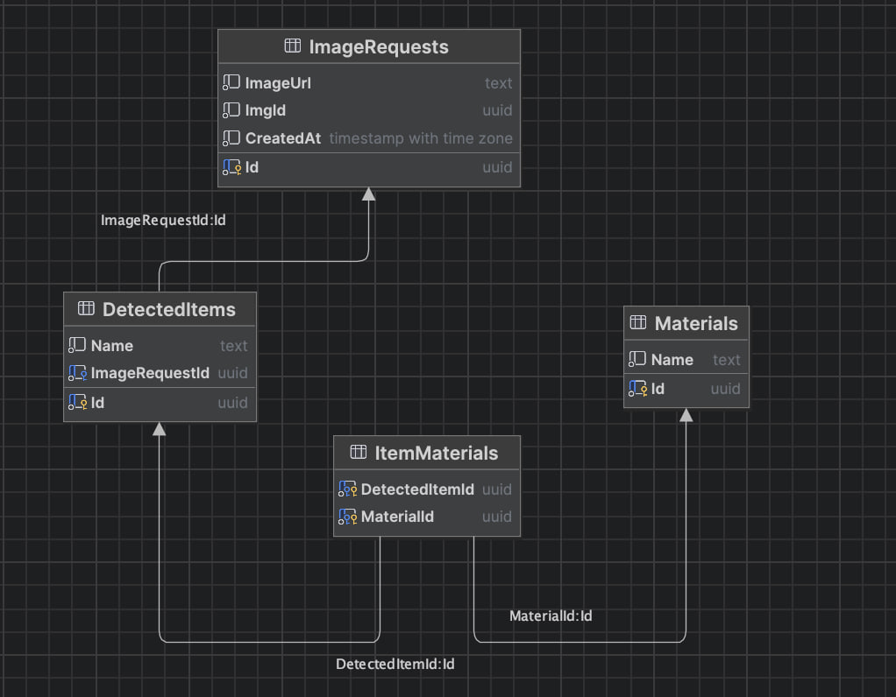

# BiogenomTestTask

### Промты
 
- Поиск предметов:
  ```
  Найди главные объекты на изображении и верни ответ в виде JSON массива в нижнем регистре, на русском языкe
  ```
- Поиск материалов:
  ```
   У тебя есть следующий список с объектами, обнаруженными на изображении: рабочий стол, инструменты, станок.
   Определи, из каких материалов состоят перечисленные объекты, 
   и верни результат строго в формате JSON-словаря и в нижнем регистре, на русском языке:
   Пример:
   {
    "рабочий стол": "дерево",
    "инструменты": "металл",
    "станок": "металл",
    "станок": "пластик"
   }
  
### Диаграмма БД


### Примеры запросов
- ``/api/ImageAnalysis/CheckItems``
  На запрос передаем ссылку на изображение в body:
  ```
  "https://mossklad.ru/upload/iblock/680/snc00v17ci0ziids6wot990fd42jv0gv/sls_6_locksmith_table_20_03.jpg"
  ```
  Если все успешно, получаем:
  ```
  {
  "responseId": "6f651440-61ef-4e55-abe3-e98ef9884381",
  "detectedItems": [
    "стол",
    "рабочий",
    "станок",
    "люди"
  ]
  }
  ```
- ``/api/ImageAnalysis/CheckMaterials``
  Передаем полученный responseId и обнаруженные предметы:
  ```
  {
  "id": "df5e11b7-b12a-4bdb-aff9-b9ef3c41ac09",
  "detectedItems": [
    "рабочие"
  ]
  }
  ```
  Если все успешно, получаем:
  ```
  {
  "detectedItems": [
    "рабочие"
  ],
  "itemMaterials": {
    "рабочие": "ткань"
    }
  }
  ```
### Инструкция по запуску

- Создать миграцию: `dotnet ef migrations add InitialCreate \
--project BiogenomTestTask \
--startup-project BiogenomTestTask`
- Применить миграцию: `dotnet ef database update`
- Запуск приложения: `dotnet run --project BiogenomTestTask`

***Перед запуском в appsettings.json необходимо указать актуальные `ClientId`, `ClientSecret` и `DefaultConnection`***